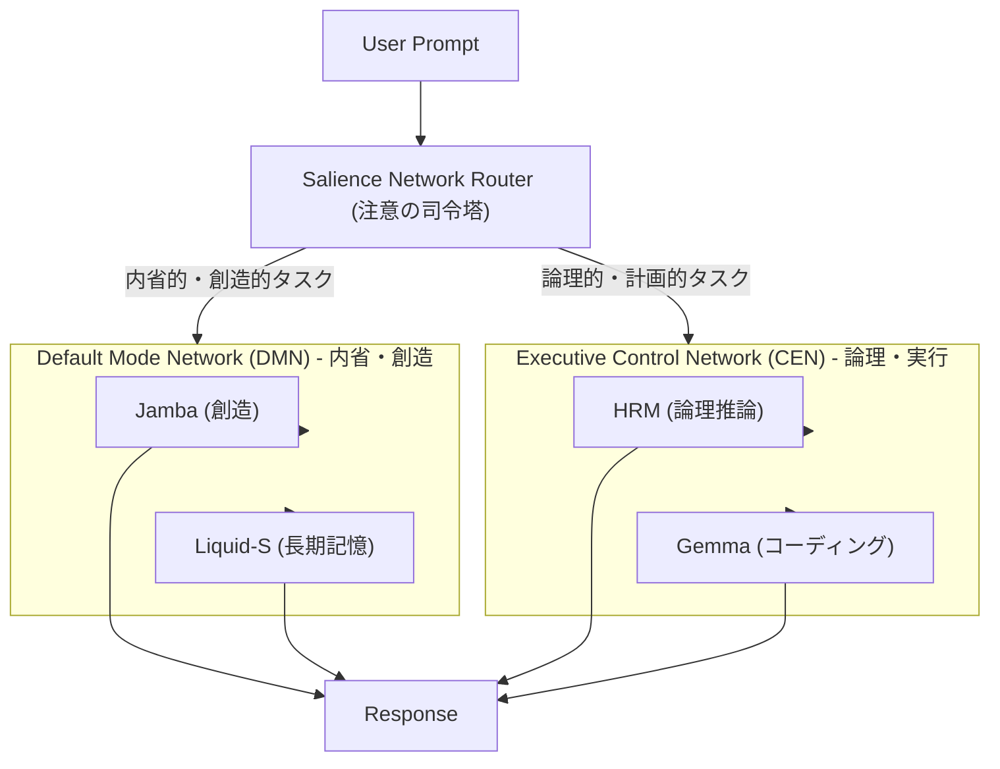

# **ブレイン・シミュレーション・アーキテクチャ**

## **1. 設計思想：脳の機能的ネットワークを模倣した協調的思考システム**

このシステムは、単一の万能モデルではなく、複数のアーキテクチャが異なるモデル（Transformerモデル、Gembaモデル、HRMモデル、Liquid-Sモデル）を協調動作させる仕組みとして設計されています。
それ以外の専門性を持っているモデルを追加しやすいよう設計されており、今後どのように専門性を持ったモデルが協調動作できるか実験をするためのプログラムです。

司令塔となる「**顕著性ネットワーク・ルーター (Salience Network Router)**」がユーザーからの要求（外部刺激）や内部状態を分析し、現在のタスクに最適な思考モード（デフォルトモード・ネットワーク or 実行制御ネットワーク）を動的に選択。選択されたネットワークに属するエキスパートAI群が協調して、高度な思考や問題解決を行います。

このアーキテクチャは、実際の脳の動作原理にインスパイアされており、以下の利点を実現します。

* **文脈に応じた思考モードの切り替え**: 集中して問題を解く「CENモード」と、自由に発想を広げる「DMNモード」を使い分けることで、より人間らしい柔軟な応答を生成します。
* **リソースの最適化**: 思考モードに応じて必要なエキスパート群のみをロードするため、効率的なリソース活用が可能です。
* **高い拡張性**: 新しいモデルや機能ネットワークを容易に追加・統合できる、スケーラブルな設計です。

## **2. システムアーキテクチャ**



## **3. 主な機能と担当ネットワーク**

* **顕著性ネットワーク・ルーター (Salience Network Router)**:
    * **役割**: 注意の司令塔。ユーザープロンプトを分析し、思考モードをDMNとCENの間で切り替えます。
* **デフォルトモード・ネットワーク (DMN)**:
    * **役割**: 内省、自己参照、未来の想像、創造的な物語生成。
    * **担当エキスパート**:
        * **Jamba (Mamba+Transformer)**: 話し相手の言語に合わせた自然な対話、創造的な文章作成を担当。
        * **Liquid-S4**: 長期的な記憶や文脈の保持・要約を担当。
* **実行制御ネットワーク (CEN)**:
    * **役割**: 集中、計画、論理的推論、問題解決。
    * **担当エキスパート**:
        * **HRM**: 複雑な論理パズルや計画立案を担当。
        * **Gemma**: コーディングや具体的な指示の実行を担当。

## **4. ディレクトリ構成とセットアップ**

```
/hybrid_llm_system
├── config/
│   └── models.yml
├── container/
│   └── container.py
├── domain/
│   ├── schemas.py
│   └── manager.py
├── model_files/
│   └── (ここに.ggufファイルを配置)
├── orchestrator/
│   └── cognitive_orchestrator.py
├── services/
│   └── model_loader.py
├── workspace/
│   └── global_workspace.py
├── .env
├── main.py
├── requirements.txt
└── README.md
```

## **5. セットアップとインストール**

#### **ステップ1: 依存ライブラリのインストール**

```bash
pip install -r requirements.txt
```

#### **ステップ2: LLMモデルのダウンロード**
**`model_files`** ディレクトリを新規に作成し、GGUF形式のモデルファイルを配置してください。

#### **ステップ3: 環境変数の設定**
`.env`ファイルを作成し、`model_files`内の各モデルへのパスを記述します。

```env
# .envファイル
JAMBA_MODEL_PATH="./model_files/AI21-Jamba-Mini-1.7.i1-Q2_K_S.gguf"
TRANSFORMER_MODEL_PATH="./model_files/gemma-3-4b-it-qat-q4_0.gguf"
HRM_MODEL_PATH="./model_files/L3.1-Dark-Reason-Dark-Plnt-Hrm-R1-Uncen-Hrr-Imtr-MAX-8B-D_AU-IQ3_XXS-imat.gguf"
LIQUIDS4_MODEL_PATH=""


#### **ステップ2: LLMモデルのダウンロード**

このシステムは4つのモデルを使用します。modelsディレクトリを作成し、GGUF形式のモデルファイルを配置してください。

* **汎用モデル (Jamba/Mambaベース)**
    * ダウンロード先: [id-challenge/Jamba-v0.1-GGUF](https://huggingface.co/mradermacher/AI21-Jamba-Mini-1.7-i1-GGUF)
* **汎用・コーディングモデル (Gemma/Transformerベース)**
    * ダウンロード先: [Hugging Face](https://huggingface.co/google/gemma-3-4b-it-q4_0.gguf)
* **階層的推論モデル (HRM)**
    * ダウンロード先: [Sapient/HRM GitHub](https://huggingface.co/DavidAU/L3.1-Dark-Reasoning-Dark-Planet-Hermes-R1-Uncensored-Horror-Imatrix-MAX-8B-GGUF)
* **状態空間モデル (Liquid-S4)**
    * ダウンロード先: [raminmh/liquid-s4 GitHub](https://github.com/raminmh/liquid-s4) (未テスト)

#### **ステップ3: 環境変数の設定**

.envファイルを作成し、4つのモデルへのパスを記述します。

```env
# .envファイル
JAMBA_MODEL_PATH="./models/AI21-Jamba-Mini-1.7.i1-Q2_K_S.gguf"
GEMMA_MODEL_PATH="./models/gemma-3-4b-it-q4_0.gguf"
HRM_MODEL_PATH="./models/L3.1-Dark-Reason-Dark-Plnt-Hrm-R1-Uncen-Hrr-Imtr-MAX-8B-D_AU-IQ3_XXS-imat.gguf"
LIQUIDS4_MODEL_PATH=""
```

## **6. 使い方**

```bash
python main.py
```

## **7. 動作の仕組み**

1. main.pyがDIコンテナを通じてHybridLLMSystemを初期化します。
2. HybridLLMSystemは司令塔であるModelRouterを内部に保持します。
3. ユーザーから質問を受け取ると、ModelRouterがキーワードや文脈を分析し、使用するモデル（jamba, gemma, hrm, liquids4）を決定します。
4. HybridLLMSystemは、目的のモデルが現在メモリにロードされていなければ、現在のモデルを解放し、新しいモデルを読み込みます（スワッピング）。
5. 選択されたエキスパートに最適なプロンプト形式を動的に生成し、推論を実行して応答を返します。
