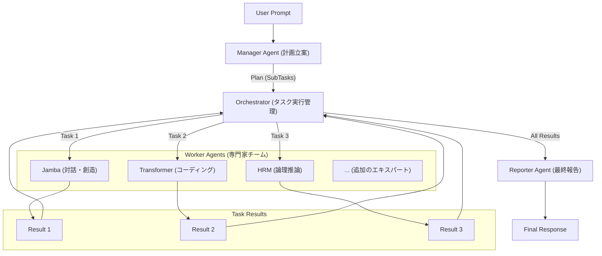

# **階層型AIエージェント・コラボレーションシステム**

## **1. 設計思想：自律的な専門家チームによる階層型タスク解決**

このシステムは、単一の万能モデルではなく、複数の専門AIエージェントが協調して複雑なタスクを解決する、スケーラブルなアーキテクチャとして設計されています。企業の組織構造を模倣し、各エージェントが明確な役割を担うことで、高度な問題解決を実現します。

* **マネージャー (Manager)**: ユーザーからの曖昧な要求を受け取り、具体的なサブタスクに分解し、実行計画を立案するCEOまたはプロジェクトマネージャーの役割を担います。
* **ワーカー (Worker)**: 各分野の専門家チームです。計画に基づき、コーディング、推論、創造的な文章作成といった個別のタスクを実行します。
* **リポーター (Reporter)**: 全ワーカーの成果を統合し、ユーザーに対して首尾一貫した最終報告書を作成する報告担当者の役割を担います。

このアーキテクチャは、以下の利点を実現します。

* **スケーラビリティ**: 新しい専門知識を持つワーカーエージェントを数百、数万と追加しても、システム全体が破綻することなく対応可能です。
* **柔軟性**: 固定のワークフローに縛られず、マネージャーがタスクに応じて動的に最適な実行計画を立案します。
* **堅牢性**: 各エージェントが自身の役割に特化しているため、複雑なタスクでも安定して処理を実行できます。

## **2. システムアーキテクチャ**



## **3. ディレクトリ構成**

```
/hybrid_llm_system
├── agents/
│   ├── base_agent.py
│   ├── manager_agent.py
│   ├── worker_agent.py
│   └── reporter_agent.py
├── config/
│   └── models.yml
├── container/
│   └── container.py
├── domain/
│   ├── manager.py
│   └── schemas.py
├── model_files/
│   └── (ここに.ggufファイルを配置)
├── orchestrator/
│   └── hierarchical_orchestrator.py
├── services/
│   └── model_loader.py
├── .env
├── main.py
├── requirements.txt
└── README.md
```

## **4. セットアップとインストール**

#### **ステップ1: 依存ライブラリのインストール**

```bash
pip install -r requirements.txt
```

#### **ステップ2: LLMモデルのダウンロード**

model_files ディレクトリを新規に作成し、config/models.yml で定義されているGGUF形式のモデルファイルを配置してください。

* **Jamba**: [mradermacher/AI21-Jamba-Mini-1.7-i1-GGUF](https://huggingface.co/mradermacher/AI21-Jamba-Mini-1.7-i1-GGUF)
* **Gemma (Transformer)**: [google/gemma-2-9b-it-gguf](https://huggingface.co/google/gemma-2-9b-it-gguf)
* **HRM**: [DavidAU/L3.1-Dark-Reasoning-Dark-Planet-Hermes-R1-Uncensored-Horror-Imatrix-MAX-8B-GGUF](https://huggingface.co/DavidAU/L3.1-Dark-Reasoning-Dark-Planet-Hermes-R1-Uncensored-Horror-Imatrix-MAX-8B-GGUF)
* **(任意) LiquidS4**

#### **ステップ3: 環境変数の設定**

.env.sample を参考に .env ファイルを作成し、model_files 内の各モデルへのパスを記述します。

```bash
# .envファイル
JAMBA_MODEL_PATH="./model_files/AI21-Jamba-Mini-1.7.i1-Q2_K_S.gguf"
TRANSFORMER_MODEL_PATH="./model_files/gemma-2-9b-it-q4_0.gguf"
HRM_MODEL_PATH="./model_files/L3.1-Dark-Reason-Dark-Plnt-Hrm-R1-Uncen-Hrr-Imtr-MAX-8B-D_AU-IQ3_XXS-imat.gguf"
LIQUIDS4_MODEL_PATH=""
```

## **5. 使い方**

```bash
python main.py
```

## **6. 動作の仕組み**

1. main.py がDIコンテナを通じて HierarchicalOrchestrator と各エージェントを初期化します。
2. ユーザーからプロンプトを受け取ると、オーケストレーターは **Manager Agent** を呼び出します。
3. **Manager Agent** は、ユーザーの要求を分析し、達成に必要なサブタスクのリスト（実行計画）を動的に生成します。単純な挨拶には単一のタスクを、複雑な要求には複数のタスクを、それぞれのタスクに最適なエキスパートを割り当てて計画します。
4. オーケストレーターは、計画に従って **Worker Agent** を呼び出し、サブタスクを依存関係を解決しながら順番に実行させます。
5. 全てのワーカータスクが完了すると、オーケストレーターは **Reporter Agent** を呼び出します。
6. **Reporter Agent** は、全ワーカーの成果を統合し、ユーザーの元の要求に対する最終的な回答を生成して返します。
